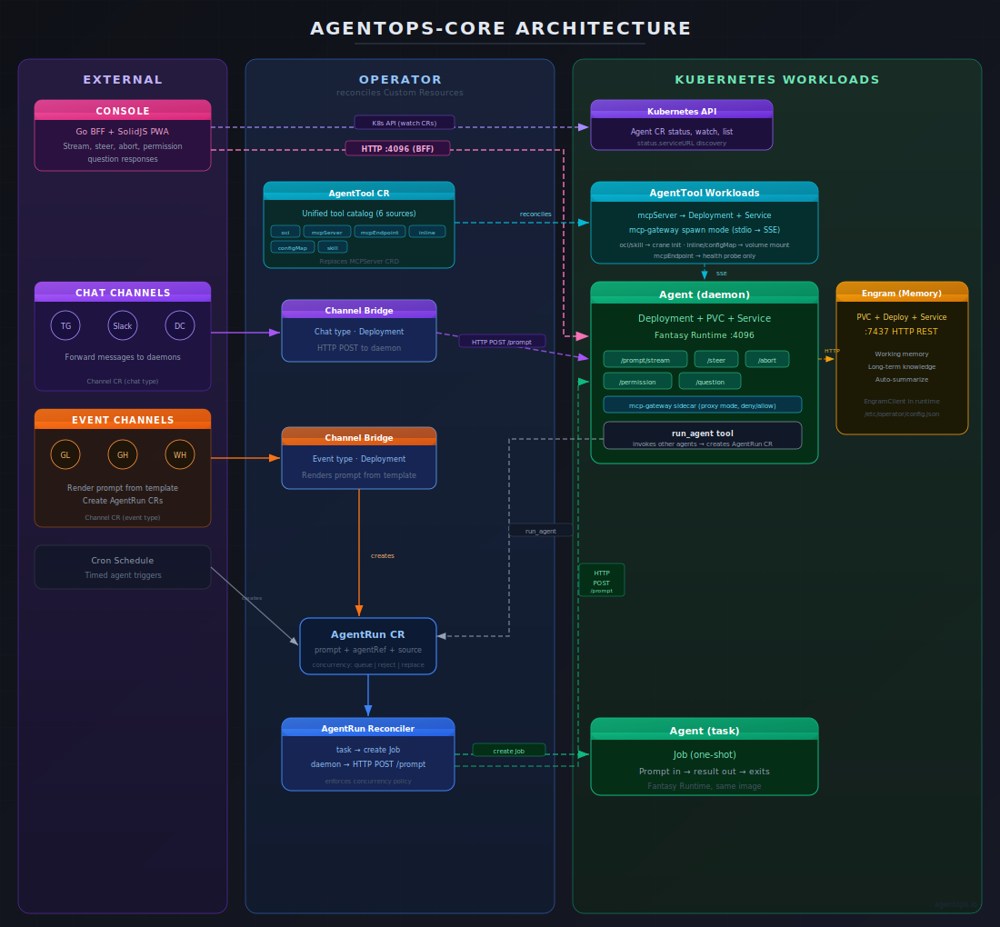

# agentops-core

Kubernetes operator for deploying AI agents as native workloads. Define agents, tools, channels, and resources as Custom Resources — the operator handles deployments, jobs, storage, networking, MCP gateway sidecars, channel bridges, concurrency control, and memory integration. Agents run the [Charm Fantasy SDK](https://github.com/charmbracelet/fantasy) via the standalone [agentops-runtime](https://github.com/samyn92/agentops-runtime).

## Architecture

<picture>
  
</picture>

<details>
<summary>Text version</summary>

```
EXTERNAL                       OPERATOR (reconciles)                     KUBERNETES

  Telegram ─┐                 ┌──────────────────┐
  Slack    ──┤  Channel CRs   │  Channel Bridge   │  HTTP POST /prompt
  Discord  ──┤──────────────► │  (Deployment)     │─────────────────────► Agent (daemon)
             │  chat types    │                   │                       Deployment + PVC + Service
             │  forward msgs  └──────────────────┘                       Runtime + HTTP (:4096)
             │  directly                                                  ├── /prompt/stream
  GitLab  ───┤                                                            ├── /steer, /abort
  GitHub  ───┤  event types   ┌──────────────────┐                       └── /permission, /question
  Webhook ───┘──────────────► │  Channel Bridge   │─── creates ──► AgentRun CR
                              │  (renders prompt  │                  │
                              │   from template)  │                  │
                              └──────────────────┘                  │
                                                                    │
  run_agent tool ──────────────────── creates ─────────────────► AgentRun CR
  (agent calling another agent)                                     │
                                                                    │
  Cron Schedule ───────────────────── creates ─────────────────► AgentRun CR
                                                                    │
                                                                    ▼
                                                        ┌──────────────────┐
                                                        │ AgentRunReconciler│
                                                        │                  │
                                                        │ task agent?      │
                                                        │   → create Job   │──► Agent (task)
                                                        │                  │    Job (one-shot)
                                                        │ daemon agent?    │    exits on completion
                                                        │   → HTTP POST    │──► Agent (daemon)
                                                        │     /prompt      │    (already running)
                                                        └──────────────────┘

  AgentTool CRs                 ┌──────────────────┐
  (mcpServer source) ─────────► │  MCP Deployment   │  (mcp-gateway spawn mode)
                                │  + Service        │◄──── SSE ──── gw sidecar in Agent pod
  (mcpEndpoint source) ─────────│  health probe     │               (proxy mode, deny/allow rules)
                                └──────────────────┘
  (oci source) ─────────────────────── crane init ──────────► /tools/<name> in Agent pod
  (skill source) ───────────────────── crane init ──────────► /skills/<name> in Agent pod
  (inline/configMap source) ────────── ConfigMap mount ─────► /tools/<name> in Agent pod

  Engram (memory)              ┌──────────────────┐
  Deployed separately          │  PVC + Deployment │  :7437 (HTTP REST)
  Referenced via spec.memory   │  + Service        │◄──── HTTP ──── Agent pods
                               └──────────────────┘               (EngramClient in runtime)

  Console ─────────────────────────── HTTP :4096 ─────────────────► Agent (daemon)
  (Go BFF + SolidJS PWA)                                            /prompt/stream, /steer, /abort
  agent-system namespace                                            /permission, /question
```
</details>

### Data Flow

| Source | Target Agent Mode | Path |
|--------|:-----------------:|------|
| Chat channel (Telegram/Slack/Discord) | daemon | Channel bridge -> HTTP POST -> Agent Service |
| Event channel (GitLab/GitHub/Webhook) | daemon or task | Channel bridge -> AgentRun CR -> Reconciler |
| `run_agent` tool | daemon or task | Daemon agent -> AgentRun CR -> Reconciler |
| Cron schedule | daemon or task | Operator -> AgentRun CR -> Reconciler |

## Custom Resource Definitions

Five CRDs in API group `agents.agentops.io/v1alpha1`:

| CRD | Short Name | Description |
|-----|-----------|-------------|
| `Agent` | `ag` | AI agent — model, tools, memory, mode |
| `AgentRun` | `ar` | Single prompt execution against an agent |
| `Channel` | `ch` | Bridge from external platforms to agents |
| `AgentTool` | `agtool` | Unified tool catalog — OCI, MCP, inline, skill |
| `AgentResource` | `ares` | External resource catalog (repos, S3, docs) |

### Agent

Two modes:

- **`daemon`** — long-running Deployment + PVC + Service. Receives prompts via HTTP, maintains conversation state in working memory, persists knowledge to Engram.
- **`task`** — one-shot Job per AgentRun. Prompt in, structured result out, container exits.

Spec highlights:

| Field Group | Key Fields |
|-------------|------------|
| Runtime | `image`, `builtinTools`, `temperature`, `maxOutputTokens`, `maxSteps` |
| Model | `model`, `primaryProvider`, `titleModel`, `providers`, `fallbackModels` |
| Identity | `systemPrompt`, `contextFiles` |
| Tools | `tools` (AgentTool bindings with per-agent permissions), `permissionTools`, `enableQuestionTool` |
| Memory | `memory` (Engram integration: serverRef, project, contextLimit, windowSize, autoSummarize) |
| Tool Hooks | `toolHooks` (blocked commands, allowed paths, audit tools) |
| Resources | `resourceBindings` (bind AgentResource CRs for context injection) |
| Schedule | `schedule` (cron), `schedulePrompt` |
| Concurrency | `concurrency.maxRuns`, `concurrency.policy` (queue/reject/replace) |
| Storage | `storage` (PVC for daemon agents) |
| Infrastructure | `resources`, `serviceAccountName`, `timeout`, `networkPolicy` |

### AgentRun

Tracks a single execution. Created by channels, cron schedules, or the `run_agent` orchestration tool. Fields: `agentRef`, `prompt`, `source`, `sourceRef`. Status includes `phase`, `output`, `toolCalls`, `model`, `usage`.

Concurrency is enforced per-agent: `queue` (FIFO wait), `reject` (fail immediately), `replace` (cancel previous run).

### Channel

Bridges external platforms to agents. Two bridge types:

- **Chat channels** (Telegram, Slack, Discord) — forward messages directly as HTTP POST to daemon agents
- **Event channels** (GitLab, GitHub, Webhook) — render prompts from templates, create AgentRun CRs

Deployed as Deployments with optional Ingress + TLS (cert-manager).

### AgentTool

Unified tool catalog entry. Defines a tool by what it does, not how it's delivered. Six source types:

| Source | Description |
|--------|-------------|
| `oci` | OCI artifact containing an MCP tool server binary. Pulled via crane init container. |
| `configMap` | Tool script mounted from a ConfigMap. |
| `inline` | Embedded tool content (< 4KB, prototyping). Written to a ConfigMap by the operator. |
| `mcpServer` | Operator-managed MCP server (Deployment + Service). Replaces the old MCPServer deploy mode. |
| `mcpEndpoint` | External MCP endpoint. Health-checked by the operator. Replaces the old MCPServer external mode. |
| `skill` | OCI-packaged skill markdown (system prompt extensions). Pulled via crane init container. |

Agents reference AgentTool CRs via `spec.tools[]` bindings, which support per-agent permission overrides, direct tool promotion, and auto-context injection (skills).

Agent pods include MCP gateway sidecars in proxy mode that enforce per-agent deny/allow permission rules on `tools/call` requests.

### AgentResource

Catalog of external resources agents can bind to. Supports:

| Kind | Config |
|------|--------|
| `github-repo` | owner, repo, defaultBranch, apiURL |
| `github-org` | org, repoFilter, apiURL |
| `gitlab-project` | baseURL, project, defaultBranch |
| `gitlab-group` | baseURL, group, projects filter |
| `git-repo` | url, branch |
| `s3-bucket` | bucket, region, endpoint, prefix |
| `documentation` | urls |

Resources are bound to agents via `spec.resourceBindings` with optional `readOnly` and `autoContext` flags. The console uses these bindings to provide file/commit/branch/issue browsing and per-turn context injection.

## Memory

The operator generates memory configuration for agents that specify `spec.memory`. The `resolveMemoryServerURL` function resolves the Engram server URL by:

1. Looking up a matching AgentTool CR by `serverRef` name (mcpServer/mcpEndpoint sources)
2. Falling back to in-cluster service DNS (`http://<serverRef>.<namespace>.svc:7437`)

This configuration is injected into `/etc/operator/config.json` and consumed by the runtime's EngramClient.

```yaml
spec:
  memory:
    serverRef: engram
    project: my-agent        # defaults to agent name
    contextLimit: 5
    windowSize: 20
    autoSummarize: true
```

## Webhooks

Four validating webhooks (non-mutating, `failurePolicy: Fail`):

- **Agent** — validates mode, model format, provider references, tool binding names, concurrency policy, cron syntax
- **Channel** — validates platform type, chat vs event mode, required fields per platform, template syntax
- **AgentTool** — validates exactly one source block is set, source-specific required fields, deny/allow mode only on MCP sources
- **AgentResource** — validates kind, required kind-specific fields, URL formats

## MCP Gateway

Custom Go binary in `images/mcp-gateway/` with two modes:

- **Spawn mode** — wraps an MCP server subprocess (stdio JSON-RPC) behind HTTP+SSE. Used by AgentTool mcpServer Deployments.
- **Proxy mode** — sidecar in agent pods that forwards MCP requests to the upstream server while enforcing per-agent deny/allow permission rules on `tools/call` requests.

## Project Structure

```
agentops-core/
  api/v1alpha1/              # CRD types + webhooks
    agent_types.go           #   Agent
    agentrun_types.go        #   AgentRun
    channel_types.go         #   Channel
    agenttool_types.go       #   AgentTool
    agentresource_types.go   #   AgentResource
    shared_types.go          #   MemorySpec, common types
    *_webhook.go             #   Validating webhooks
  cmd/main.go                # Operator entrypoint
  internal/
    controller/              # 5 reconcilers
    resources/               # K8s resource builders + tests
  images/
    mcp-gateway/             # MCP gateway binary (spawn + proxy)
  config/
    crd/bases/               # Generated CRD manifests
    rbac/                    # Generated RBAC
    manager/                 # Operator Deployment
    webhook/                 # Webhook configuration
    samples/                 # Example CRs
  hack/
    dev/                     # Dev pod manifest + init script
  Dockerfile                 # Multi-stage, distroless
  Makefile                   # Build, generate, deploy targets
```

## Quick Start

### Install CRDs

```sh
make install
```

### Run the operator locally

```sh
make run
```

With webhooks (requires cert-manager):

```sh
make run ARGS="--enable-webhooks"
```

### Deploy to a cluster

```sh
make docker-build docker-push IMG=ghcr.io/samyn92/agentops-operator:latest
make deploy IMG=ghcr.io/samyn92/agentops-operator:latest
```

### Create a minimal agent

```yaml
apiVersion: agents.agentops.io/v1alpha1
kind: Agent
metadata:
  name: my-agent
spec:
  mode: daemon
  model: anthropic/claude-sonnet-4-20250514
  primaryProvider: anthropic
  providers:
    - name: anthropic
      apiKeySecret:
        name: llm-api-keys
        key: ANTHROPIC_API_KEY
  builtinTools:
    - bash
    - read
    - edit
    - write
  tools:
    - name: gitlab-mcp
  memory:
    serverRef: engram
```

### Create a tool

```yaml
apiVersion: agents.agentops.io/v1alpha1
kind: AgentTool
metadata:
  name: gitlab-mcp
spec:
  description: "GitLab MCP server"
  category: scm
  mcpServer:
    image: ghcr.io/samyn92/mcp-gitlab:latest
    port: 8080
```

### Trigger a run

```yaml
apiVersion: agents.agentops.io/v1alpha1
kind: AgentRun
metadata:
  name: test-run
spec:
  agentRef: my-agent
  source: channel
  sourceRef: manual
  prompt: "List all files in the workspace"
```

### Apply sample resources

```sh
kubectl apply -k config/samples/
```

## Development

### Dev pod (recommended)

The dev pod runs in-cluster with source code mounted via hostPath:

```sh
kubectl apply -f hack/dev/dev-pod.yaml
kubectl exec -it -n agent-system deploy/agentops-dev -- bash

# Inside the pod:
make generate       # regen deepcopy
make manifests      # regen CRD + RBAC manifests
make install        # apply CRDs to cluster
make run            # run operator
```

### Local

```sh
make generate       # Generate DeepCopy methods
make manifests      # Generate CRD, RBAC, Webhook manifests
go build ./...      # Build
make test           # Run tests (envtest)
make lint           # Run golangci-lint
```

## Images

| Image | Source | Purpose |
|-------|--------|---------|
| `ghcr.io/samyn92/agentops-operator` | `Dockerfile` | Kubernetes operator |
| `ghcr.io/samyn92/agentops-runtime` | [agentops-runtime](https://github.com/samyn92/agentops-runtime) | Agent runtime |
| `ghcr.io/samyn92/mcp-gateway` | `images/mcp-gateway/` | MCP protocol gateway |
| `ghcr.io/samyn92/engram` | [engram](https://github.com/samyn92/engram) | Shared memory server |

## Related

- [agentops-runtime](https://github.com/samyn92/agentops-runtime) — Agent runtime (Fantasy SDK + Engram memory)
- [agentops-console](https://github.com/samyn92/agentops-console) — Web console (Go BFF + SolidJS PWA)
- [Engram](https://github.com/samyn92/engram) — Shared memory server (fork)
- [Charm Fantasy SDK](https://github.com/charmbracelet/fantasy) — AI agent framework

## License

Apache 2.0
